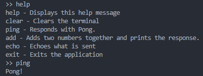
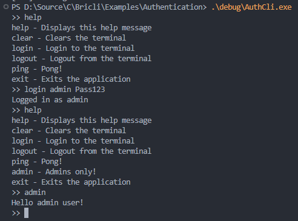

# BriCLI
BriCLI (pronounced Bric-lee) is an easy-to-use C Command Line Interface library 



## Contents 
- [BriCLI](#bricli)
	- [Contents](#contents)
	- [A Note About Escape Codes](#a-note-about-escape-codes)
	- [Install Guide](#install-guide)
	- [Configuration](#configuration)
	- [Examples](#examples)
	- [Porting Guide](#porting-guide)
	- [User Guide](#user-guide)
		- [Adding BriCLI to your project](#adding-bricli-to-your-project)
		- [Initialisation](#initialisation)
		- [Basic Command Loop](#basic-command-loop)
		- [Different Send and Receive EoLs](#different-send-and-receive-eols)
			- [Normal operation with just Eol](#normal-operation-with-just-eol)
			- [Seperate operation with Eol and SendEol](#seperate-operation-with-eol-and-sendeol)
		- [Custom Parsing](#custom-parsing)
		- [State Change Events](#state-change-events)
		- [Command Handlers](#command-handlers)
		- [Command List](#command-list)
		- [Built-In Commands](#built-in-commands)
		- [Authentication](#authentication)


## A Note About Escape Codes
Currently escape codes aren't supported, it is recommended that your application ignore escape codes prior to them reaching BriCLI as shown in the examples.

## Install Guide
The only required files are the `Source/bricli.c`, `Source/bricli.h` and `Config/bricli_config.h`, these contain the full BriCLI functionality.

Always obtain the source files from the latest [release](https://github.com/AnthonyRBWall/BriCLI/releases) to ensure best compatibility.

```bash
git clone --depth 1 --branch "<release>" git@github.com:AnthonyRBWall/BriCLI.git
```

You can clone older releases if needed, such as the `v1.0.0` build:

```bash
git clone --depth 1 --branch "v1.0.0" git@github.com:AnthonyRBWall/BriCLI.git
```

## Configuration
There are several settings that can be applied to BriCLI via the `bricli_config.h` file, they are listed below:

| Setting | Default | Description |
| --- | --- | --- |
| **BRICLI_SHOW_COMMAND_ERRORS** | On | When on, BriCLI will automatically report command handler errors to the user |
| **BRICLI_SHOW_HELP_ON_ERROR** | On | When on, BriCLI will automatically show the help message when an unknown command is received |
| **BRICLI_USE_REENTRANT** | Off | When on, BriCLI will use the thread safe `strtok_r` in place of `strtok` |
| **BRICLI_USE_COLOUR** | On | When on, enables the use of VT100 colour commands |
| **BRICLI_MAX_COMMAND_LEN** | 10 | The maximum length any user command can be |
| **BRICLI_ARGUMENT_BUFFER_LEN** | 70 | The length of the internal arguments buffer |
| **BRICLI_MAX_ARGUMENTS** | 3 | The maximum number of arguments BriCLI can parse |
| **BRICLI_PRINT_MESSAGE_SIZE** | 80 | The maximum length a PrintF message can be |
| **BRICLI_USE_TEXT_COLOURS** | On | Enables the use of VT100 text colours |
| **BRICLI_USE_BOLD** | On | Enables the use of VT100 bold text colours |
| **BRICLI_USE_UNDERLINE** | On | Enables the use of VT100 underline colours |
| **BRICLI_USE_BACKGROUNDS** | On | Enables the use of VT100 background colours |

## Examples
An example application for using BriCLI on various platforms can be found under the Examples directory. Currently the following examples are supported:

- Simple CLI for use on most x86/x64 systems

## Porting Guide
The only port functionality required by BriCLI is the BspWrite function, this must be provided by the developer in all circumstances.

## User Guide
### Adding BriCLI to your project
BriCLI is contained entirely in a single source and header pair, simply copy these files into your application and use `#include "bricli.h"` anywhere you want to call the BriCLI API.

### Initialisation
The basic pre-requisites for using BriCLI are the command list, the CLI settings, the BspWrite function and the RX buffer.
```c
static BricliCommand_t _commandList[] =
{
    {"ping", Ping_Handler, "Responds with Pong."},
    {"add", Add_Handler, "Adds two numbers together and prints the response."},
    {"colours", Colour_Handler, "Demonstrates VT100 colours."},
	BRICLI_COMMAND_LIST_TERMINATOR
};

int main(void)
{
    BricliHandle_t cli;
	BricliInit_t cliInit = {0};

    cliInit.Eol = "\r";     
    cliInit.SendEol = NULL; // Set this to have BriCLI use a different EoL in Bricli_WriteLine* functions.
    cliInit.BspWrite = Bsp_Write;
    cliInit.CommandList = _commandList;
    cliInit.RxBuffer = _rxBuffer;
    cliInit.RxBufferSize = RX_BUFFER_SIZE;
    cliInit.LocalEcho = true;

	Bricli_Init(&cli, &cliInit);
    
    // ...
}
```

### Basic Command Loop
A very simple command loop is shown below, this particular style is ideal for use within task/thread based OSs, a baremetal superloop may instead wish to check an ISR bound flag.
```c
void SomeTask()
{
    char rxChar;

    while (true)
    {
        // OS specific, see examples.
        osWaitForMessage(&rxChar);

        // Simple escape code flusher.
        // Needed as of version beta-1.0.0
        if (rxChar == '\e')
        {
            do
            {
                // OS Specific, see examples.
                bool msgFound = osWaitForMessage(&rxChar, 10ms);
            } while (msgFound);
        }

        // As of v2.2.0 this is only needed when cli.LocalEcho is false
        // Echo the character back to the terminal.
        // Bricli_Write(&cli, 1, &rxChar);

        // Store the character in BriCLI's buffer
        Bricli_ReceiveCharacter(&cli, rxChar);

        // Let BriCLI handle parsing
        Bricli_Parse(&cli);
    }
}
```

### Different Send and Receive EoLs
BriCLI supports using a separate send and receive Eol where needed.

By default, `Eol` will be used for both parsing received data and sending out data.

However, this functionality can be overwritten by setting `SendEol` to a non-NULL value. In this case, `Eol` will be used for parsing received data but `SendEol` will be used when sending out data.

#### Normal operation with just Eol
```c
// \n should be received and sent
cli.Eol = "\n";

Bricli_Parse(&cli); // This will look for \n
Bricli_WriteStringLine(&cli, "Hello World") // This will send "Hello World\n"
```

#### Seperate operation with Eol and SendEol
```c
// \n should be received but \r sent.
cli.Eol = "\n"
cli.SendEol = "\r"

Bricli_Parse(&cli); // This will look for \n
Bricli_WriteStringLine(&cli, "Hello World") // This will send "Hello World\r"
```

### Custom Parsing
If you need more finite control over the EOL checking or command parsing you can manually implement <code>Bricli_Parse()</code> as below.
```c
size_t numberOfCommands;
int result = BricliOk;

// Look for an EOL, repeating for as long as we have commands in the buffer.
numberOfCommands = Bricli_SplitOnEol(cli);
while(numberOfCommands > 0)
{
    // Handle the command.
    result = Bricli_ParseCommand(cli);

    // Remove the command we just handled
    Bricli_ClearCommand(cli);

    // Reset our internal state.
    Bricli_ChangeState(cli, BricliStateIdle);

    // Track that we have handled this command.
    numberOfCommands--;

    // If we just handled the last command send the CLI prompt.
    if (numberOfCommands == 0)
    {
        Bricli_SendPrompt(cli);
    }
}
return result;
```
This approach also lets you pass false to <code>Bricli_CheckForEol</code> to prevent BriCLI from altering the RX Buffer should you need to.

### State Change Events
Internally, BriCLI tracks 4 different states:

- **Idle**: BriCLI is receiving characters
- **Parsing**: BriCLI is parsing the receive buffer for a valid command
- **RunningHandler**: BriCLI is currently executing a command handler.
- **Finished**: BriCLI has finished executing a command handler and is waiting to be reset.

Users can monitor these state changes through the CLI handle's `OnStateChanged` event. This event is fired anytime a state change occurs and provides the old and new states as parameters.

To subscribe to the event simple provide a callback function with the `Bricli_StateChanged` prototype.

```c
// Example user function implementing the callback.
void MyStateChanged(BricliStates_t oldState, BricliStates_t newState)
{
    if (newState == BriCLIRunningHandler)
    {
        printf("BriCLI entered a command handler!");
    }
}

// Subscribing to the event.
int main()
{
    // ...
    
    BricliHandle_t myCli = BRICLI_HANDLE_DEFAULT;
    myCli.OnStateChanged = MyStateChanged;

    // ...
}
```

### Command Handlers
Command handlers should follow the <code>Bricli_CommandHandler</code> format, a simple addition handler is shown below.

Negative return codes will automatically be handled as errors by BriCLI, so ensure all success codes are zero or greater.
```c
int Add_Handler(uint32_t numberOfArgs, char* args[])
{
  // Make sure we have enough arguments.
  if (numberOfArgs < 2)
  {
    Bricli_WriteString(&cli, "Must provide 2 arguments!\n");
    return -1;
  }

  // Convert the arguments to numbers.
  int a = strtol(args[0], NULL, 10);
  int b = strtol(args[1], NULL, 10);

  // Calculate the addition and return.
  int result = a + b;
  Bricli_PrintF(&cli, "%d + %d = %d\n", a, b, result);
  return 0;
}
```

### Command List
The command list is defined by the <code>BricliCommand_t</code> type. There are three members of this type:

- Name: This is the command text that the user must enter
- Handler: This is a pointer to the function that will be executed when this command is found.
- HelpMessage: An optional string that can be displayed by the "help" command

### Built-In Commands
There are two built in commands that are provided by BriCLI <code>clear</code> and <code>help</code>.

<code>clear</code> will execute a VT100 response that clears the remote terminals output window.

<code>help</code> will display all commands in the cli's command list, including built-in commands, along with their HelpMessage if one was provided


### Authentication
BriCLI offers a built-in scope based authentication system based loosely on AuthN/AuthZ practices. The default scope for commands is `BricliScopeAll` which can be accessed by all users, including those not authenticated

Authentication (AuthN) is the process of a user logging in, BriCLI does this using the `login <user> <pass>` system command.

BriCLI then checks the init provided `AuthList` for a match, if one is found the authorization (AuthZ) scopes are applied and all relevant commands are unlocked for use.

In the sample below the commands `ping` and `exit` are available to all users of the CLI, even those not logged in. The `info` command is available to user1 and admin while the `reset` command is only available to admin.

Scopes can be extended with up to 30 additional flags (1 for each 32bit entry). The Admin `(1 << 1)` and User `(1 << 0)` scopes are provided for convenience.

```c
static BricliCommand_t _commandList[] =
{
    { "ping", Ping_Handler, "Pong!", BricliScopeAll },
	{ "info", Info_Handler, "Display system status", BricliScopeUser },
    { "reset", Reset_Handler, "Force a device reset", BricliScopeAdmin },
    { "exit", Exit_Handler, "Exits the application", BricliScopeAll }
};

static BricliAuthEntry_t _authList[] =
{
	{"user1", "somePass", BricliScopeUser},
	{"admin", "Pass123", (BricliScopeAdmin | BricliScopeUser)}
};
```

The `logout` command can be used to reset authorization scopes.



